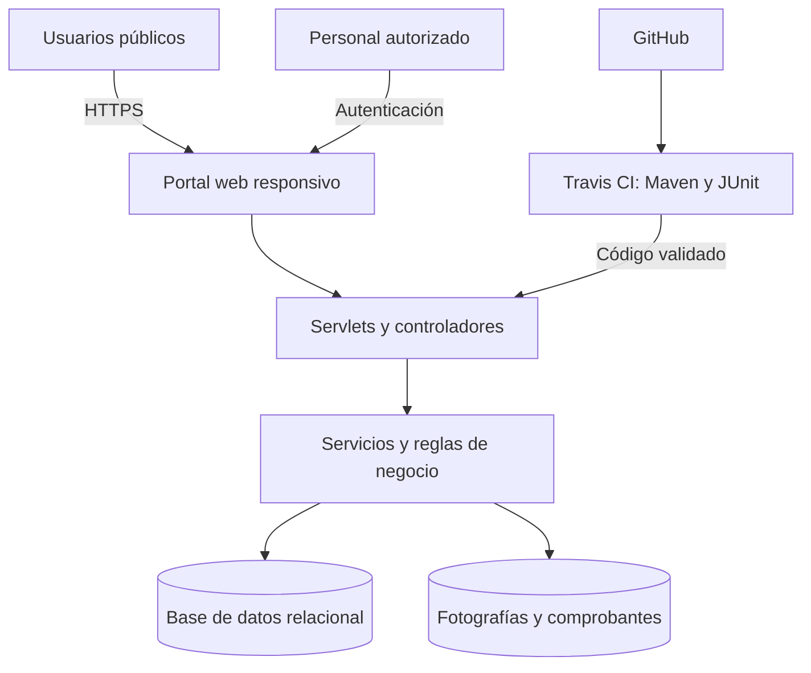

# SIPU – Sistema Integral Patitas Unidas

Aplicación web para apoyar la gestión de animales rescatados por **Patitas Unidas
Dgo**, asociación dirigida por Bilay Campos en Durango, México.

## Tabla de contenidos

1. [Resumen ejecutivo](#resumen-ejecutivo)
2. [Descripción](#descripción)
3. [Problema identificado](#problema-identificado)
4. [Solución propuesta](#solución-propuesta)
5. [Arquitectura](#arquitectura)
6. [Funcionalidad disponible](#funcionalidad-disponible)
7. [Alcance del producto](#alcance-del-producto)
8. [Tecnologías](#tecnologías)
9. [Ejecución local](#ejecución-local)
10. [Pruebas e integración continua](#pruebas-e-integración-continua)
11. [Administración del proyecto](#administración-del-proyecto)
12. [Estrategia de ramas y etapas](#estrategia-de-ramas-y-etapas)
13. [Uso](#uso)
14. [Contribución](#contribución)
15. [Roadmap](#roadmap)
16. [Documentación complementaria](#documentación-complementaria)

## Resumen ejecutivo

SIPU surge como una propuesta tecnológica para mejorar la capacidad operativa
de Patitas Unidas Dgo. Actualmente, el rescate, la atención médica, la difusión
de casos, las adopciones y la recepción de apoyos requieren coordinar una gran
cantidad de información con recursos humanos limitados. Esta situación dificulta
conocer el estado actualizado de cada animal y dar continuidad a solicitudes,
tratamientos, gastos y colaboraciones.

La solución consiste en una aplicación web accesible desde computadoras,
tabletas y teléfonos. Su primera iteración funcional permite crear expedientes,
consultar animales registrados y controlar sus cambios de estado. El desarrollo
se administra en GitHub mediante actividades, ramas y etapas Beta y General
Availability (GA); Travis CI compila el proyecto y ejecuta pruebas JUnit para
comprobar automáticamente las reglas de negocio. El producto evolucionará hacia
una plataforma centralizada con autenticación, base de datos, adopciones,
transparencia, voluntariado y seguimiento de salud.

## Descripción

El **Sistema Integral Patitas Unidas (SIPU)** centraliza la información generada
durante el ciclo de atención de perros y gatos rescatados. Contempla un portal
público para consultar animales disponibles y solicitar formas de apoyo, además
de un panel privado para que la directora y el personal autorizado administren
expedientes, adopciones, salud, gastos, donativos, voluntariado, veterinarias y
reportes.

La organización fue seleccionada por el conocimiento directo de su operación y
la cercanía con su directora, lo que permite trabajar sobre necesidades reales y
validar progresivamente el producto con quien coordina los rescates.

## Problema identificado

Patitas Unidas Dgo enfrenta saturación de animales y una carga considerable de
trabajo para coordinar información que se genera en distintos momentos y medios.
Los principales problemas identificados son:

- dificultad para mantener actualizado el expediente y estado de cada animal;
- falta de un flujo centralizado para recibir y evaluar solicitudes de adopción;
- seguimiento complejo de enfermedades, accidentes y tratamientos;
- dispersión de comprobantes, gastos, donativos y necesidades urgentes;
- dificultad para coordinar voluntarios, hogares temporales y veterinarias;
- necesidad de comunicar el uso de los apoyos con transparencia;
- dependencia del trabajo manual de la directora para relacionar toda la información.

La consecuencia no es únicamente administrativa: la información dispersa puede
retrasar decisiones, duplicar esfuerzos y reducir la capacidad para concretar
adopciones responsables que liberen espacio para nuevos rescates.

## Solución propuesta

SIPU plantea una aplicación web modular con las siguientes capacidades:

- expedientes con folio, características, condición de ingreso y estado;
- catálogo de animales disponibles;
- recepción y evaluación de solicitudes de adopción;
- historial de salud, tratamientos, veterinarias, gastos y comprobantes;
- registro de donativos y publicación responsable de información agregada;
- registro y asignación de voluntarios;
- directorio de veterinarias colaboradoras;
- reportes internos y sección pública de transparencia;
- autenticación, permisos por rol, sesiones y bitácora de acciones.

La plataforma no pretende resolver por sí sola el abandono animal. Su finalidad
es proporcionar una base operativa que permita organizar mejor los recursos,
reducir tareas repetitivas, conservar evidencias y apoyar decisiones oportunas.

## Arquitectura

SIPU utiliza una arquitectura web por capas. El navegador presenta las vistas
JSP; los Servlets reciben las solicitudes; los servicios Java aplican las reglas
de negocio; y la capa de persistencia administrará la base de datos y los
archivos. Apache Tomcat funciona como servidor de aplicaciones.



En la iteración actual, el repositorio de animales trabaja temporalmente en
memoria. La base de datos relacional, la autenticación y el almacenamiento
permanente son requisitos obligatorios antes de utilizar datos reales o publicar
la aplicación para operación cotidiana.

Consulta la [descripción técnica completa](docs/ARQUITECTURA.md).

## Funcionalidad disponible

La primera iteración Beta permite:

- abrir la página principal de SIPU;
- registrar un expediente básico de perro, gato u otro animal;
- generar un folio interno;
- consultar los expedientes registrados;
- cambiar el estado conforme a reglas de transición controladas;
- ejecutar pruebas unitarias sobre estados y almacenamiento de expedientes.

> **Limitación actual:** los registros se almacenan en memoria y se pierden al
> reiniciar Tomcat. Esta versión debe utilizarse únicamente para demostración y
> validación, sin información personal o sensible.

## Alcance del producto

La versión objetivo incluye seguridad por roles, expedientes, adopciones, salud
y gastos, donativos, voluntariado, veterinarias y reportes básicos.

Quedan fuera de la primera versión:

- procesamiento de pagos en línea;
- publicación automática mediante la API de Facebook;
- aplicación móvil nativa;
- geolocalización detallada o en tiempo real;
- notificaciones automáticas por WhatsApp o correo;
- analítica predictiva o inteligencia artificial;
- inventario avanzado de alimento y medicamentos.

## Tecnologías

- Java 17 como nivel de compilación (compatible con Java 21);
- Jakarta Servlets y JSP;
- Apache Maven;
- Apache Tomcat 10.1 o 11;
- JUnit 5;
- Travis CI;
- base de datos relacional planeada para la siguiente iteración.

## Ejecución local

Requisitos: Java 17 o superior, Maven 3.9 y Apache Tomcat compatible con Jakarta.

1. Compilar y ejecutar las pruebas:

   ```bash
   mvn clean package
   ```

2. Copiar `target/sipu.war` a la carpeta `webapps` de Tomcat.
3. Iniciar Tomcat.
4. Abrir `http://localhost:PUERTO/sipu/`, sustituyendo `PUERTO` por el configurado
   en Tomcat (por ejemplo, `8080` o `8090`).

## Pruebas e integración continua

El archivo `.travis.yml` conecta el repositorio con Travis CI. Cada ejecución
compila el proyecto mediante Maven y ejecuta las pruebas JUnit con:

```bash
mvn clean test
```

Las pruebas actuales validan transiciones de estado y el registro/recuperación
de expedientes. La ejecución exitosa debe reportar cero fallos y cero errores.

## Administración del proyecto

- [Tablero SIPU en GitHub Projects](https://github.com/users/Elias1030/projects/2)
- [Issues del producto](https://github.com/Elias1030/SIPU-Patitas-Unidas-Dgo/issues)
- [Milestones Beta y GA](https://github.com/Elias1030/SIPU-Patitas-Unidas-Dgo/milestones)
- [Pull requests](https://github.com/Elias1030/SIPU-Patitas-Unidas-Dgo/pulls)

Las tareas se categorizan con etiquetas de módulo, prioridad, tipo de trabajo y
etapa. El tablero permite distinguir actividades pendientes, en progreso y
terminadas.

## Estrategia de ramas y etapas

- `feature/<tarea>`: desarrollo individual de cada requerimiento;
- `develop`: integración y validación del código Beta;
- `master`: versión final aprobada para General Availability.

Todo cambio funcional debe integrarse primero en `develop` mediante un *pull
request*. Después de las pruebas y la aceptación, `develop` se integra en
`master` para publicar la versión GA.

## Uso

- [Manual para usuario final](docs/MANUAL_USUARIO.md): explica cómo acceder,
  registrar animales, consultar expedientes y actualizar estados.
- [Manual del administrador](docs/MANUAL_ADMINISTRADOR.md): explica cómo
  compilar, desplegar, iniciar, detener y diagnosticar la aplicación.
- [Instalación y configuración](docs/INSTALACION_CONFIGURACION.md): describe el
  ambiente de desarrollo, pruebas, archivos de configuración y alternativas de
  despliegue.

La versión Beta actual debe utilizarse solamente con datos de demostración. Los
registros se conservan en memoria mientras Tomcat permanece encendido y se
eliminan cuando el servidor se reinicia.

## Contribución

Las modificaciones deben desarrollarse en una rama `feature/<tarea>` creada a
partir de `develop`. Después de compilar y ejecutar las pruebas, el cambio se
envía a GitHub y se integra mediante un pull request. Consulta la
[guía de contribución](CONTRIBUTING.md) para conocer el procedimiento completo.

## Roadmap

El desarrollo se organiza en las etapas Beta y General Availability. Las
siguientes iteraciones incorporarán persistencia PostgreSQL, autenticación,
adopciones, salud, donativos, voluntariado, veterinarias, reportes, seguridad y
despliegue. Consulta el [roadmap del producto](ROADMAP.md).

## Documentación complementaria

- [Arquitectura de la solución](docs/ARQUITECTURA.md)
- [Instalación y configuración](docs/INSTALACION_CONFIGURACION.md)
- [Manual de usuario final](docs/MANUAL_USUARIO.md)
- [Manual del administrador](docs/MANUAL_ADMINISTRADOR.md)
- [Guía de contribución](CONTRIBUTING.md)
- [Roadmap](ROADMAP.md)

- [Programa de trabajo](Programa_Trabajo_SIPU.xlsx)
- [Repositorio público](https://github.com/Elias1030/SIPU-Patitas-Unidas-Dgo)

La documentación se mantiene dentro del repositorio para conservar la
trazabilidad entre problema, requerimientos, arquitectura, código, pruebas y
actividades del proyecto.
